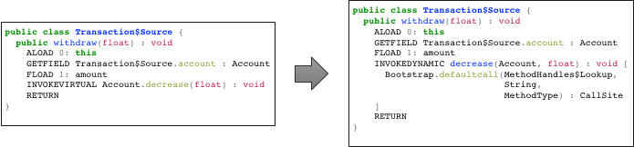
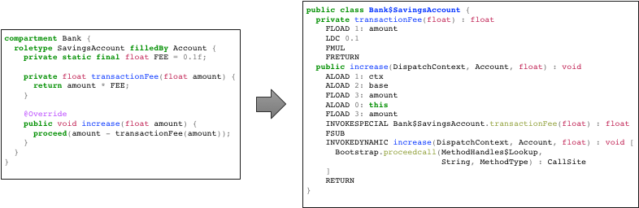

# RoleVM

[](https://travis-ci.org/martinmo/rolevm)

RoleVM is a research prototype of a minimal, efficient role-based programming runtime for Java,
based on `java.lang.invoke` and `jdk.dynalink`. It is entirely written in Java and consists of a
small Java agent and an accompanying runtime library. This version can handle more than one role
per player as well as more than one player per role. Furthermore, it solves the inherent memory
leaks and concurrency issues of the first version, which is still available in the `rolevm-1.x`
branch.


## How does it work?

- Using load-time weaving, RoleVM replaces every `invokeinterface` and `invokevirtual`
  instruction in Java classes with an equivalent `invokedynamic` instruction. We refer to such
  modified call sites as dynamic call sites: 
- Each dynamic call site dispatches method calls using role semantics. It means that the dispatch
  result depends on the currently bound roles of the receiver and can vary over time.
  - Dispatching through multiple bound roles results in a call chain such as *roleA.someMethod()*
    → *roleB.someMethod()* → *roleC.someMethod()* → *core.someMethod()*.
  - Compared to ordinary Java methods, role methods have an extended calling convention: in
    addition to the receiver argument (`this`), a role method expects a `DispatchContext` object
    and the core object on the stack, followed by the remaining arguments (see [the examples
    below](#tutorial)).
  - In role method bodies, RoleVM uses delegation semantics for calls to the core object.
    Furthermore, there is a special `proceed` instruction that can be used to call the next role of
    the ongoing method call.
- RoleVM stores object/role mappings in a concurrent hash map with weakly referenced keys. Besides
  dynamic method dispatch, such a mapping is usually the second major bottleneck of current
  role-based programming languages, because in theory, it must be queried during *each* method
  call. Thus, in a naive implementation, each invocation requires an additional hash map lookup.
- Using the [jdk.dynalink][jdk-dynalink] module, RoleVM optimizes (role) method dispatch with a
  [polymorphic inline caching][wiki-pic] schema tailored to roles, in order to make method
  invocation [fast despite the gained flexibility](#performance).
  - In particular, at stable call sites, we cache bound method handles to avoid hash map lookups
    and use cache guards with very low overheads, such as identity guards and
    [SwitchPoint][jdk-switchpoint] guards (aka [thin guards][arnold02]).
  - If the inline cache of a call site is found to be unstable, or megamorphic, RoleVM falls back
    to a slightly slower, but generic role method dispatch, and the hash map lookup will be the
    dominating performance factor.

[wiki-pic]: https://en.wikipedia.org/wiki/Inline_caching
[jdk-dynalink]: https://docs.oracle.com/javase/9/docs/api/jdk.dynalink-summary.html
[jdk-switchpoint]: https://docs.oracle.com/javase/9/docs/api/java/lang/invoke/SwitchPoint.html
[arnold02]: https://dl.acm.org/citation.cfm?id=680033


## Building this project

The library is not yet available on Maven Central. You have to build and/or install it locally
using `mvn package` or `mvn install`. The **build currently requires JDK 9**, but the resulting
JARs can be executed on JDK 10 as well.

Furthermore, the code is organized into multiple subprojects:

    rolevm
    ├── rolevm-agent
    ├── rolevm-api
    ├── rolevm-bench
    ├── rolevm-examples
    └── rolevm-runtime

The `rolevm-agent`, `rolevm-api` and `rolevm-runtime` are the core modules of RoleVM. The other
submodules, `rolevm-bench` and `rolevm-examples`, contain benchmarks, usage examples, and tests
based on the examples.

All benchmarks use the [Java Microbenchmark Harness][jmh] and should be started with the
convenience script `run_benchmark.sh`, e.g., `./run_benchmark.sh Bank`.

To see more of what is happening internally, build with `mvn package -PloggingEnabled`. This Maven
profile replaces the SLF4J NOP binding with the [Simple binding][slf4j-simple]. See the [benchmark
@argument file](rolevm-bench/jvm.options) for an example logging configuration.

[jmh]: http://openjdk.java.net/projects/code-tools/jmh/
[slf4j-simple]: https://www.slf4j.org/apidocs/org/slf4j/impl/SimpleLogger.html


## Usage

### Maven coordinates

First, to use the library, you have to declare a `provided` dependency on the `rolevm-api` Maven
artifact (this requires `mvn install` as [described above](#building-this-project)):

```xml
<dependency>
  <groupId>com.github.martinmo.rolevm</groupId>
  <artifactId>rolevm-api</artifactId>
  <version>2.0-SNAPSHOT</version>
  <scope>provided</scope>
</dependency>
```

### Running projects based on RoleVM

Invoke `java` with the Java agent and the RoleVM runtime library on the classpath:

    java -javaagent:rolevm-agent.jar -cp rolevm-runtime.jar org.example.YourMainClass

The required JARs can be obtained using the Maven `dependency:copy` goal:

    cd path/to/rolevm
    mvn install && mvn dependency:copy -DoutputDirectory=path/to/your/project


## Tutorial

The best way to see RoleVM in action is to take a look at the demos in the `rolevm-examples`
subproject.

### Role annotation

The RoleVM API can bind roles to arbitrary objects, and base and role types are *not* required to
implement some particular interface or extend a particular class. Instead, role types are annotated
using the `@Role` annotation:

```java
import rolevm.api.Role;
public @Role class RoleType {
}
```

#### Around, Before, After and Replace

Suppose you have a class `A` that you want to use as a base:

```java
public class A {
  public int m(int x) {
    return x * x;
  }
}
```

Then the accompanying, minimum role definition looks like this:

```java
public @Role class R {
}
```

To override a method *m* with the signature *rtype m(ptype0, ptype1, …)* in the base class *A*,
you have to define a method *m* in the role class *R* with a signature of *rtype m(DispatchContext,
A, ptype0, ptype1, …)*. During method dispatch, the RoleVM runtime will bind the additional leading
arguments.

Please note that all methods in `java.lang.Object` cannot be intercepted by a role. This is
intentional and prevents breaking Java language rules, such as the `hashCode()`/`equals()`
contract.

Here are some examples of how to adjust the behavior of method `int A.m(int)`:

```java
/* Add behavior around, before or after the base method */
public @Role class R1 {
  public int m(DispatchContext ctx, A base, int x) {
    System.out.println("Before");
    int r = (int) ctx.proceed().invoke(ctx, base, x);
    System.out.println("After");
    return r;
  }
}
/* Replace the base method */
public @Role class R2 {
  public int m(DispatchContext ctx, A base, int x) {
    // no call to proceed()
    return x * x * x;
  }
}
/* Conditionally replace the base method */
public @Role class R3 {
  public int m(DispatchContext ctx, A base, int x) {
    if (x < 42) {
      // no call to proceed()
      return x * x * x;
    }
    return (int) ctx.proceed().invoke(ctx, base, x);
  }
}
```

Of course, `ctx.proceed().invoke()` is a very crude looking construct. It is needed to conform to
the syntactic rules of plain Java and in order to avoid boxing all arguments into an `Object[]`. It
takes advantage of the fact that `MethodHandle.invoke()` is a [signature polymorphic
method][sigpoly]. Ideally, we would have a domain specific language that translates like this:



[sigpoly]: https://docs.oracle.com/javase/9/docs/api/java/lang/invoke/MethodHandle.html#sigpoly


### Compartments

In the RoleVM API, roles depend on compartments. A `@Role` class must be an inner class of a type
that extends `rolevm.api.Compartment`:

```java
import rolevm.api.*;
public MyCompartment extends Compartment {
  public @Role class RoleType {
  }
}
```

### Instantiating and binding roles

Role instantiation and (un)binding are explicit and depend on the compartment.

```java
MyCompartment c = new MyCompartment();
BaseType base = new BaseType();
RoleType role = c.new RoleType();
c.bind(base, role);
c.unbind(base, role);
```


## Current limitations

- Only classes with a minimum class format version of 1.7 can be transformed.


## Caveats and workarounds

- You can exclude problematic classes or packages from bytecode transformation using the system
  property `rolevm.exclude`, e.g., `java -Drolevm.exclude=org/example/pkg1/,org/example/pkg2/ ...`.
  (You still can attach roles to instances of untransformed classes, but self calls wont be
  delegated to roles.)
- Proceed calls in lambdas or anonymous inner classes result in `NoSuchMethodError`s at runtime.
- You should disable the "Hot Code Replace" feature of the Eclipse Debugger, if you want to debug
  programs that use the RoleVM agent. There is an awkward interference between that debugger and
  the agent, which will make it jump around to arbitrary breakpoints on its own.


## Performance

### OT/J vs RoleVM vs SCROLL basecall overhead

Measured with JDK 9.0.4 (VM 9.0.4+11) on the same machine using the synthetic NoopCompartment
benchmarks.

OT/J 2.6.x ([OT/J benchmark source][otjbench]):

    Benchmark                             (numRoles)  Mode  Cnt    Score   Error  Units
    NoopBenchmark.basecall_noargs                  1  avgt   10  186.101 ± 4.509  ns/op
    NoopBenchmark.basecall_primitiveargs           1  avgt   10  238.219 ± 7.745  ns/op
    NoopBenchmark.basecall_withargs                1  avgt   10  195.115 ± 4.209  ns/op
    NoopBenchmark.baseline                         1  avgt   10    0.439 ± 0.021  ns/op

RoleVM 1.x:

    Benchmark                                        Mode  Cnt   Score   Error  Units
    NoopCompartmentBenchmark.basecall_noargs         avgt   10  15.118 ± 1.348  ns/op
    NoopCompartmentBenchmark.basecall_primitiveargs  avgt   10  14.519 ± 0.463  ns/op
    NoopCompartmentBenchmark.basecall_withargs       avgt   10  14.934 ± 0.401  ns/op
    NoopCompartmentBenchmark.baseline                avgt   10   0.419 ± 0.015  ns/op

RoleVM 2.x with `rolevm.unstableRelinkThreshold=20`:

    Benchmark                              (gc)  (numRoles)  Mode  Cnt  Score   Error  Units
    NoopBenchmark.basecall_noargs         false           1  avgt   10  7.166 ± 0.373  ns/op
    NoopBenchmark.basecall_primitiveargs  false           1  avgt   10  7.724 ± 0.260  ns/op
    NoopBenchmark.basecall_withargs       false           1  avgt   10  7.196 ± 0.201  ns/op
    NoopBenchmark.baseline                  N/A         N/A  avgt   10  0.442 ± 0.016  ns/op

RoleVM 2.x with `rolevm.unstableRelinkThreshold=1`:

    Benchmark                              (gc)  (numRoles)  Mode  Cnt   Score   Error  Units
    NoopBenchmark.basecall_noargs         false           1  avgt   10  39.560 ± 1.733  ns/op
    NoopBenchmark.basecall_primitiveargs  false           1  avgt   10  34.482 ± 1.993  ns/op
    NoopBenchmark.basecall_withargs       false           1  avgt   10  33.887 ± 1.735  ns/op
    NoopBenchmark.baseline                  N/A         N/A  avgt   10   0.440 ± 0.016  ns/op

SCROLL (units are µs instead of ns, [SCROLL benchmark source][scrollbench]):

    Benchmark                             (cached)  Mode  Cnt   Score    Error  Units
    NoopBenchmark.basecall_noargs             true  avgt   10   3.548 ±  0.155  us/op
    NoopBenchmark.basecall_primitiveargs      true  avgt   10   4.732 ±  0.173  us/op
    NoopBenchmark.basecall_withargs           true  avgt   10   5.590 ±  0.176  us/op
    NoopBenchmark.baseline                     N/A  avgt   10  ≈ 10⁻³           us/op

[otjbench]: https://github.com/martinmo/otjbench
[scrollbench]: https://github.com/martinmo/SCROLL


## License and copyright

Except otherwise noted in the source code, see [LICENSE](LICENSE).
